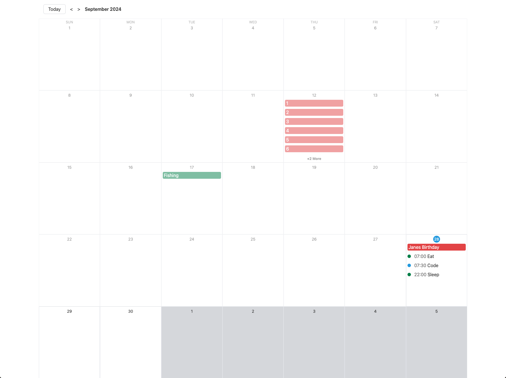

<div style="display: flex; align-items: center; justify-content: center;" align="center">
  
</div>

# CC Calendar

A customizable calendar application that allows users to view and manage events in a monthly grid. This project is built with React, using modern hooks and context for state management.

## Features

- Add, edit, and delete events
- Responsive monthly calendar view
- Event modals with animations
- Customizable event colors

## Requirements

- Node.js (version 14.x or higher)
- npm (version 6.x or higher)

## Installation

1. **Clone the repository:**

```bash
 git clone https://github.com/ScaxCodes/cc-calendar.git
 cd cc-calendar
```

2. **Install dependencies:**

```bash
npm install
```

## Running the Development Server

To start the development server, run:

```bash
npm start
```

Your application should now be running at http://localhost:3000.

## Running on CodeSandbox

Alternatively, you can run the project on CodeSandbox:

1. Open the repository in CodeSandbox by navigating to https://codesandbox.io/s/github/ScaxCodes/cc-calendar.
2. The environment will automatically install dependencies and start the application.
